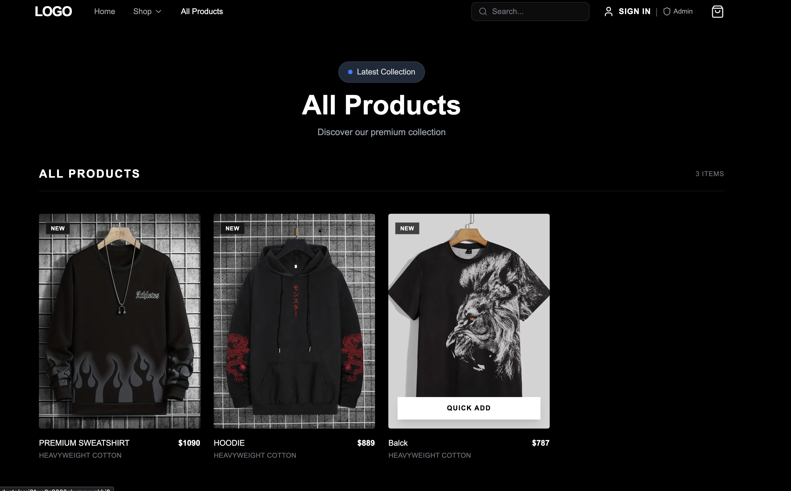
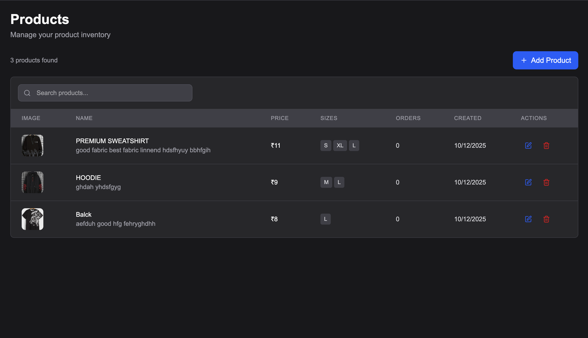
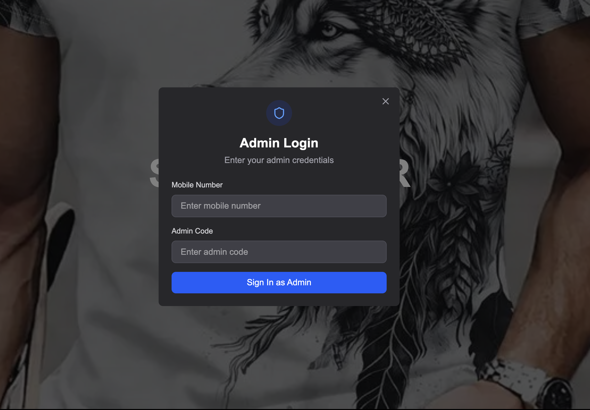

# ThreadForge - Modern T-Shirt E-commerce Platform

A full-stack Next.js e-commerce platform built for custom t-shirt sales with comprehensive admin dashboard, secure authentication, and seamless shopping experience.

**Live Demo:** `https://your-domain.com` *(coming soon)*

## 📸 Screenshots

| Homepage | All Products | Product Details | Admin Dashboard |
|----------|-------------|----------------|----------------|
|  |  |  |  |


---

## ✨ Features

### 🛍️ **Customer Features**
- **Product Browsing** - Responsive product catalog with filtering and search
- **Product Details** - High-quality image gallery with size selection
- **Shopping Cart** - Persistent cart with quantity management
- **User Authentication** - Secure JWT-based auth with mobile verification
- **Order Management** - Order history and status tracking
- **Responsive Design** - Mobile-first responsive UI with dark mode support

### 🔧 **Admin Features**
- **Dashboard Analytics** - Sales metrics, revenue tracking, and key statistics
- **Product Management** - CRUD operations with image upload via UploadThing
- **Order Management** - Order processing and status updates
- **User Management** - Customer data and account management
- **Secure Admin Access** - Protected admin routes with role-based authentication

---

## 🚀 Tech Stack

### **Frontend**
- **Next.js 16** - React framework with App Router
- **TypeScript** - Type safety and better developer experience
- **TailwindCSS 4** - Utility-first CSS framework
- **Lucide Icons** - Modern icon library
- **React Hook Form + Zod** - Form handling with validation
- **Zustand** - Lightweight state management
- **React Hot Toast** - Beautiful notifications

### **Backend & Database**
- **Next.js API Routes** - Server-side API endpoints
- **Prisma ORM** - Type-safe database client
- **Neon PostgreSQL** - Serverless PostgreSQL database
- **JWT Authentication** - Secure token-based authentication

### **File Storage & Media**
- **UploadThing** - File upload service
- **ImageKit** - Image optimization and delivery

### **Development Tools**
- **ESLint** - Code linting and formatting
- **PostCSS** - CSS processing
- **TypeScript** - Static type checking

---

## 📁 Project Structure

```
tshirt/
├── app/                    # Next.js App Router
│   ├── (storefront)/      # Customer-facing pages
│   │   ├── products/      # Product catalog & details
│   │   ├── cart/          # Shopping cart
│   │   └── about/         # About page
│   ├── admin/             # Admin dashboard
│   │   ├── products/      # Product management
│   │   ├── orders/        # Order management
│   │   └── users/         # User management
│   └── api/               # API routes
│       ├── auth/          # Authentication endpoints
│       ├── cart/          # Cart operations
│       └── products/      # Product CRUD operations
├── components/            # Reusable UI components
│   ├── admin/            # Admin-specific components
│   ├── auth/             # Authentication components
│   ├── nav/              # Navigation components
│   └── shared/           # Shared components
├── actions/              # Server actions
├── lib/                  # Utility functions
├── store/                # Zustand state stores
├── prisma/               # Database schema & migrations
└── types/                # TypeScript type definitions
```

---

## 🔐 Environment Variables

Create a `.env` file in the root directory:

```env
# Database (Neon PostgreSQL)
DATABASE_URL="postgresql://..."
DIRECT_URL="postgresql://..."

# JWT Authentication
JWT_SECRET="your-super-secret-jwt-key"

# File Upload (UploadThing)
UPLOADTHING_TOKEN="your-uploadthing-token"

# Image Optimization (ImageKit)
IMAGEKIT_PUBLIC_KEY="public_your-key"
IMAGEKIT_PRIVATE_KEY="private_your-key"
NEXT_PUBLIC_IMAGEKIT_URL_ENDPOINT="https://ik.imagekit.io/your-id"

# Admin Access
ADMIN_MOBILE="8109537034"
ADMIN_NAME="ikshant"
ADMIN_CODE="ADMIN2024"

# Environment
NODE_ENV="development"
```

---

## ⚙️ Installation & Setup

### **Prerequisites**
- Node.js 18+ 
- npm or yarn
- PostgreSQL database (Neon recommended)

### **1. Clone & Install**
```bash
git clone https://github.com/your-username/threadforge.git
cd threadforge
npm install
```

### **2. Database Setup**
```bash
# Generate Prisma client
npx prisma generate

# Run database migrations
npx prisma migrate deploy

# Seed database (optional)
npx prisma db seed
```

### **3. Start Development Server**
```bash
npm run dev
```

Visit `http://localhost:3000` to see the application.

---

## 🏗️ Build & Production

```bash
# Build for production
npm run build

# Start production server
npm start

# Lint code
npm run lint
```

---

## 🛡️ Admin Access

### **Admin Dashboard**
- **URL:** `/admin`
- **Mobile:** `8109537034`
- **Code:** `ADMIN2024`

The admin dashboard is protected with role-based authentication. Only users with `ADMIN` role can access admin routes.

### **Admin Features:**
- Product management (create, read, update, delete)
- Order processing and status updates
- User management and analytics
- Sales dashboard with key metrics

---

## 🔌 API Routes

### **Authentication**
- `POST /api/auth/admin-login` - Admin authentication
- `POST /api/auth/register` - User registration
- `GET /api/auth/check-user` - Verify user session

### **Products**
- `GET /api/products` - Fetch all products
- `POST /api/products` - Create new product (admin)
- `PUT /api/products/[id]` - Update product (admin)
- `DELETE /api/products/[id]` - Delete product (admin)

### **Cart & Orders**
- `GET /api/cart` - Fetch user cart
- `POST /api/cart` - Add item to cart
- `DELETE /api/cart/[id]` - Remove item from cart
- `POST /api/cart/clear` - Clear cart

### **File Upload**
- `POST /api/uploadthing` - Handle file uploads

---

## 🗄️ Database Schema

### **Core Models**
```prisma
Product {
  id, name, description, price
  images[], sizes[]
  cartItems[], orderItems[]
}

User {
  id, name, email, mobile, role
  cartItems[], orders[]
}

Order {
  id, userId, totalAmount, status
  orderItems[]
}

CartItem {
  id, userId, productId, quantity, size
}
```

**Database:** PostgreSQL on Neon (serverless)  
**ORM:** Prisma with type-safe client generation

---

## 🚧 Future Improvements

- **Payment Integration** - Stripe/Razorpay for secure payments
- **Inventory Management** - Stock tracking and low-stock alerts  
- **Email Notifications** - Order confirmations and status updates
- **Advanced Analytics** - Detailed sales reports and customer insights
- **Product Reviews** - Customer rating and review system
- **Wishlist Feature** - Save products for later
- **Multi-language Support** - Internationalization (i18n)
- **PWA Support** - Progressive Web App capabilities
- **Advanced Search** - Filters, sorting, and faceted search

---

## 🤝 Contributing

1. **Fork the repository**
2. **Create feature branch:** `git checkout -b feature/amazing-feature`
3. **Commit changes:** `git commit -m 'Add amazing feature'`
4. **Push to branch:** `git push origin feature/amazing-feature`  
5. **Open Pull Request**

### **Development Guidelines**
- Follow TypeScript best practices
- Use ESLint and Prettier for code formatting
- Write meaningful commit messages
- Update documentation for new features

---

## 📝 License

This project is licensed under the MIT License - see the [LICENSE](LICENSE) file for details.

---

## 👨‍💻 Developer

**Ikshant Shukla**  
*Full Stack Developer*

- Portfolio: `https://your-portfolio.com`
- LinkedIn: `https://linkedin.com/in/your-profile`  
- GitHub: `https://github.com/your-username`

---

*Built with ❤️ using Next.js, TypeScript, and modern web technologies*